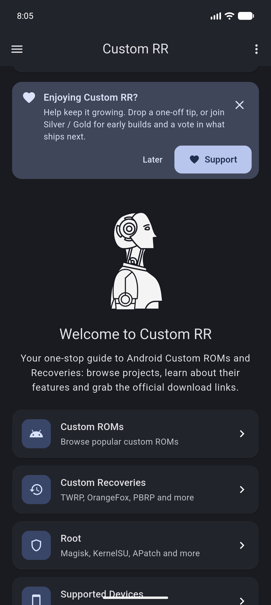
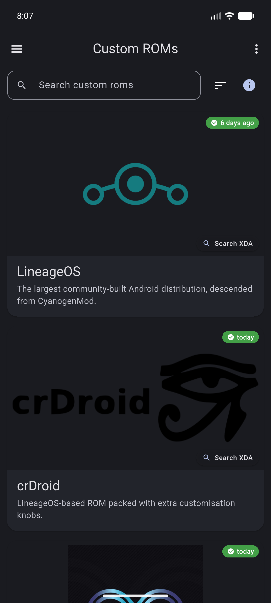
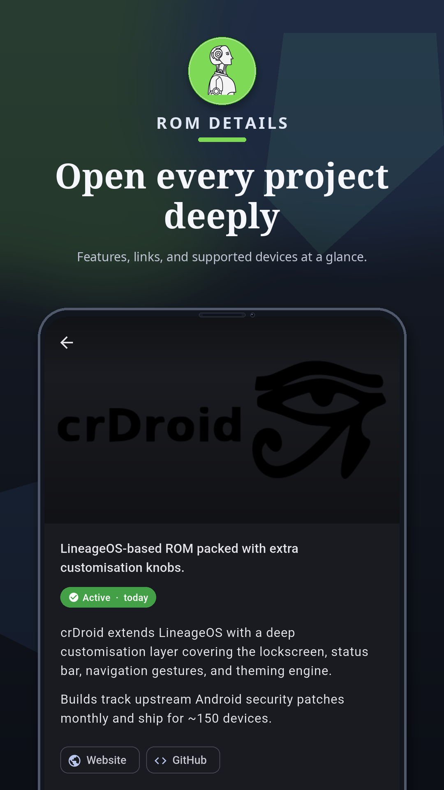
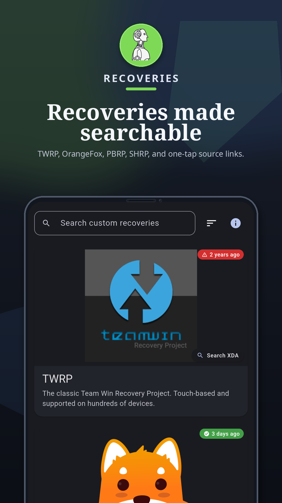
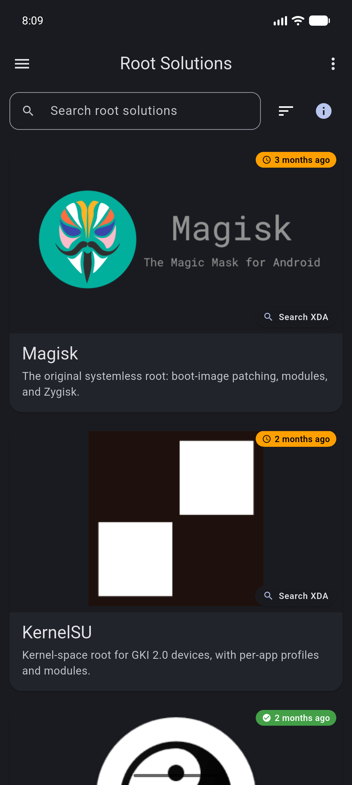
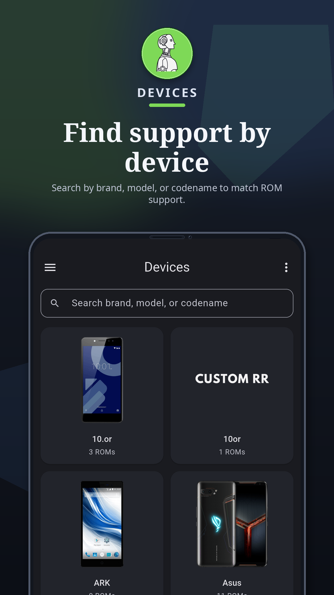

# Custom RR: ROMs & Recovery

_By [Monsiu](https://github.com/monsiu) · [github.com/monsiu/Custom-RR](https://github.com/monsiu/Custom-RR)_

  
  
  
  
  

  
  
  
  
  

> A single home for popular **custom ROMs** and **custom recoveries**: direct links to the official builders, screenshots, freshness signals, and step-by-step flashing guides. No tracking, no ads, no Play Services. GPL-3.0.

  <strong>Get the app</strong> 
  
  
  
  

## Why Custom RR?

The custom-ROM world is scattered across dozens of sites, Telegram channels, and
XDA threads, and half the "guides" you find point at projects that have not
shipped a build in years. Custom RR pulls the **actively maintained** ROMs,
recoveries, and Treble GSIs into one place, tells you which are alive (and which
are not), shows you what officially supports **your** phone, and links straight
to the real download page. **18 actively maintained ROMs**, **5 recoveries**,
**500+ devices**, sourced live from the LineageOS wiki + the PixelOS
`official_devices` repo and refreshed nightly.

  
  
  
  
  
  

## Contents

- [Google Play status](#google-play-status)
- [Features](#features)
- [Roadmap](#roadmap)
- [Deep links](#deep-links)
- [Download](#download)
- [Contributing](#contributing)
- [Support the project](#support-the-project)
- [Catalog sources](#catalog-sources)

## Google Play status

Custom RR is now **publicly available on Google Play**.

You can also install from
[GitHub Releases](https://github.com/monsiu/Custom-RR/releases/latest) or the
[Amazon Appstore](https://www.amazon.com/gp/mas/dl/android?p=io.github.monsiu.custom_rr).
The [F-Droid listing](https://gitlab.com/fdroid/fdroiddata/-/merge_requests/39380)
is still under review.

## Features

- **Curated Custom ROMs.** LineageOS, crDroid, PixelOS, Project Elixir, Evolution X, DerpFest, UN1CA, BlissROMs, /e/, GrapheneOS, CalyxOS, DivestOS, RisingOS Revived, VoltageOS, and more, each with description, features, screenshots, and a one-tap link to the official download page.
- **Curated Custom Recoveries.** TWRP, OrangeFox, PBRP, SHRP, with per-device support and direct downloads.
- **Defunct projects clearly marked.** ArrowOS, DotOS, Havoc-OS, PotatoAOSP, RisingOS (original), MoKee, RR, AOSPE, Dirty Unicorns, Octavi OS are listed in an archived section with last-build date and successor suggestions, so users do not flash code that hasn't shipped in years.
- **Project warning banners.** Per-entry warnings call out community-relevant concerns (for example the 2024 Project Elixir killswitch incident) so users get the context before they flash.
- **Device → Compatible Builds.** Pick your phone and the whole app filters to ROMs and recoveries that officially support it, with per-phone-model chips for every supported device.
- **Brand pages.** Tap Xiaomi, OnePlus, Samsung, Google Pixel, Realme, POCO, Nothing, etc. and see every device + every ROM/recovery that targets that brand.
- **Treble & GSI hub.** Per-project status badges, direct GSI downloads, the canonical TrebleDroid wiki index, an A-only vs A/B + arm64 vs arm32_binder64 cheat sheet, a 6-step flash flow, and a "GSI boots but camera is broken" FAQ.
- **Freshness signals on every entry.** Active / monthly / discontinued labels plus last-build date, refreshed nightly by a GitHub Action that flags projects going quiet.
- **Always-current remote catalog.** The catalog lives on `raw.githubusercontent.com`, and the app refreshes from it on launch, so new ROMs, recoveries, devices, links, and freshness dates appear the moment they are published, with no app or store update required. The bundled `assets/catalog.json` is only a fallback that keeps the app fully usable offline.
- **Clickable link chips on every detail page** (Telegram, GitHub, Discord, Matrix, forum, web) sourced from a curated `links` field in the catalog.
- **"How to flash" guides** for ROMs and recoveries, embedded per category, no wiki digging.
- **Deep links / shareable URLs** for every ROM, recovery, device, and brand (powered by `go_router`), easy to drop in XDA threads.
- **GitHub-release update check** against GitHub Releases, with one-tap APK download + install on Android in GitHub release builds. Store builds leave updates to the store.
- **Bundled pinch-zoom image viewer** for screenshots.
- **Material 3 + dynamic color.** Light / dark / AMOLED themes, adaptive layouts (drawer on phones, NavigationRail on tablets, permanent side panel on desktop), theme + accent persisted across launches.
- **In-app privacy policy page** rendered from the bundled [`PRIVACY.md`](PRIVACY.md).
- **Zero tracking, zero ads, no Play Services, GPL-3.0**, source on GitHub.
- **Cross-platform.** Android 7.0+ (minSdk 24, target Android 16 / SDK 36), Linux desktop, Windows desktop, and macOS desktop (10.15 Catalina or newer, universal Apple Silicon + Intel).

## Roadmap

- Localisation (`flutter_localizations` + ARB)
- Crash & analytics (Sentry or Firebase Crashlytics)
- Unofficial / community-maintained build listings
- Dedicated Magisk install section
- Auto-update for the Linux, Windows, and macOS desktop builds

## Deep links

Every page has a stable URL. Examples:

| URL                  | Page                                |
| -------------------- | ----------------------------------- |
| `/`                  | Home                                |
| `/roms`              | All ROMs                            |
| `/roms/lineage`      | LineageOS detail page               |
| `/recoveries`        | All recoveries                      |
| `/recoveries/twrp`   | TWRP detail page                    |
| `/devices`           | All devices                         |
| `/devices/xiaomi`    | Xiaomi-compatible ROMs & recoveries |
| `/treble`            | Treble / GSI hub                    |

To serve these as verified **Android App Links** from your own domain, see
[CONTRIBUTING](CONTRIBUTING.md#android-app-links).

## Download

Every channel ships the **same release**. Prebuilt binaries are attached to the
[latest GitHub release](https://github.com/monsiu/Custom-RR/releases/latest).

| Platform | Where to get it |
| --- | --- |
| **Android** (7.0+, APK) | [GitHub Releases](https://github.com/monsiu/Custom-RR/releases/latest) (per-ABI), the [Amazon Appstore](https://www.amazon.com/gp/mas/dl/android?p=io.github.monsiu.custom_rr), or the [Google Play listing](https://play.google.com/store/apps/details?id=io.github.monsiu.custom_rr). [F-Droid](https://gitlab.com/fdroid/fdroiddata/-/merge_requests/39380) pending review. |
| **Linux** | `custom_rr-vX.Y.Z-linux-x64.tar.gz` |
| **Windows** | `custom_rr-vX.Y.Z-windows-x64.zip` (portable, no installer) |
| **macOS** (10.15+) | `custom_rr-vX.Y.Z-macos-universal.zip` (universal, unsigned, see the [macOS notes](CONTRIBUTING.md#macos-desktop)) |

Building any platform from source, the release flow, and how the catalog is
generated are covered in [CONTRIBUTING.md](CONTRIBUTING.md).

## Contributing

Pull requests and issues are welcome. Building from source, the release flow, the
catalog generator, and the Linux / Windows / macOS desktop builds are all
documented in **[CONTRIBUTING.md](CONTRIBUTING.md)**:

- [Build from source](CONTRIBUTING.md#build-from-source)
- [How the catalog is generated and kept current](CONTRIBUTING.md#updating-the-catalog)
- [Desktop builds (Linux, Windows, macOS)](CONTRIBUTING.md#linux-desktop)
- **Help wanted:** macOS testing on real Apple hardware, see the [macOS notes](CONTRIBUTING.md#macos-desktop).

For anything code- or catalog-related, please
[open an issue](https://github.com/monsiu/Custom-RR/issues) rather than emailing.

## Support the project

<strong>Crypto donations</strong> (same addresses shipped in the app)

Listed here too so donors can cross-check the in-app values against an
out-of-band source before sending funds.

| Coin | Address |
| ---- | ------- |
| **BTC** (Bitcoin, P2WPKH) | `bc1qaxx6dxkz0s5cw4h9nysw4yvmsaf3qlk7j0gwa2` |
| **BTC Lightning** | `monsiutech@cake.cash` |
| **LTC** (Litecoin, P2WPKH) | `ltc1qdrjqjzk0sfn7grysxruxuuev6jpn9yqm8wrrg0` |
| **ETH** / EVM (mainnet) | `0x4e815A295F8096997867FBA2d7bDC6316ad970be` |
| **BNB** Smart Chain (also accepts ETH, USDT, USDC on BSC) | `0x4aCD5AD66DD8E64e3117d9cb0CB0434294027CDd` |
| **SOL** (Solana) | `6qC53PkKjoFtyhohHnYFApf3YccZwULFLTfrUMiruM97` |
| **XMR** (Monero) | `8ADyd3DvN5D6wAauq2Q2BSZp7aG3LhYZAFswk5dNQohVUBDT8G84MjPimsj5vzfB8TBrwtC3y3BATNm76bX21kWfUys3ehE` |

Have a different coin? Use the in-app **Swap to XMR** button (powered by
[Trocador AnonPay](https://trocador.app/anonpay/), no account, no KYC).

## Socials

## Contact

Bug report, feature request or just want to say hi?

- Open an [issue on GitHub](https://github.com/monsiu/Custom-RR/issues) (preferred for anything code- or catalog-related).
- Email: [contactmonsiu@gmail.com](mailto:contactmonsiu@gmail.com)
- Telegram: [@monsiu](https://t.me/monsiu)

## License

Released under the **GNU General Public License v3.0 only** (`SPDX-License-Identifier: GPL-3.0-only`). See the [LICENSE](LICENSE) file for the full text.

## Catalog sources

Custom RR's catalog is regenerated by [`tool/sync_catalog.dart`](tool/sync_catalog.dart) from a small set of authoritative upstream sources. Credit and thanks to the maintainers of:

- [LineageOS wiki](https://github.com/LineageOS/lineage_wiki) - the canonical device list, used as the base for the Devices section and most ROM device support.
- [PixelOS-AOSP/official_devices](https://github.com/PixelOS-AOSP/official_devices) - the authoritative PixelOS device list, fetched live so the catalog reflects the current branch.
- [TrebleDroid/treble_experimentations wiki](https://github.com/TrebleDroid/treble_experimentations/wiki/Generic-System-Image-%28GSI%29-list) - the canonical cross-project Treble GSI index.
- Per-ROM download portals (LineageOS, crDroid, PixelOS, Project Elixir, Evolution X, DerpFest, UN1CA, BlissROMs, /e/ Foundation, GrapheneOS, CalyxOS, DivestOS, RisingOS, VoltageOS, and others) for download URLs and screenshots.

If a project you maintain is misrepresented here, [open an issue](https://github.com/monsiu/Custom-RR/issues) and it will be corrected.

## Stargazers over time

